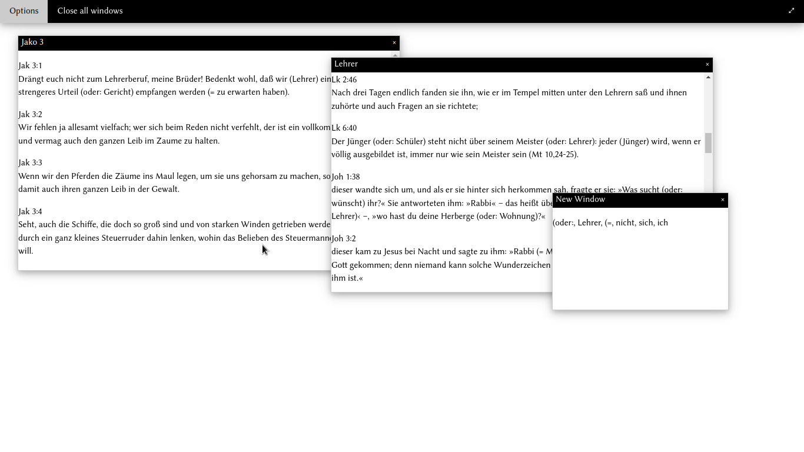

# cl-bible


## installation

You need sbcl and quicklisp set up.
Then do 
```
$ git clone https://github.com/silasfox/cl-bible.git ~/quicklisp/local-projects
$ mkdir -p ~/.bible
$ cp ~/quicklisp/local-projects/cl-bible/resources/*.sexp ~/.bible/
$ sbcl
* (ql:quickload :cl-bible)
* (in-package :cl-bible-user)
* (start)
```
